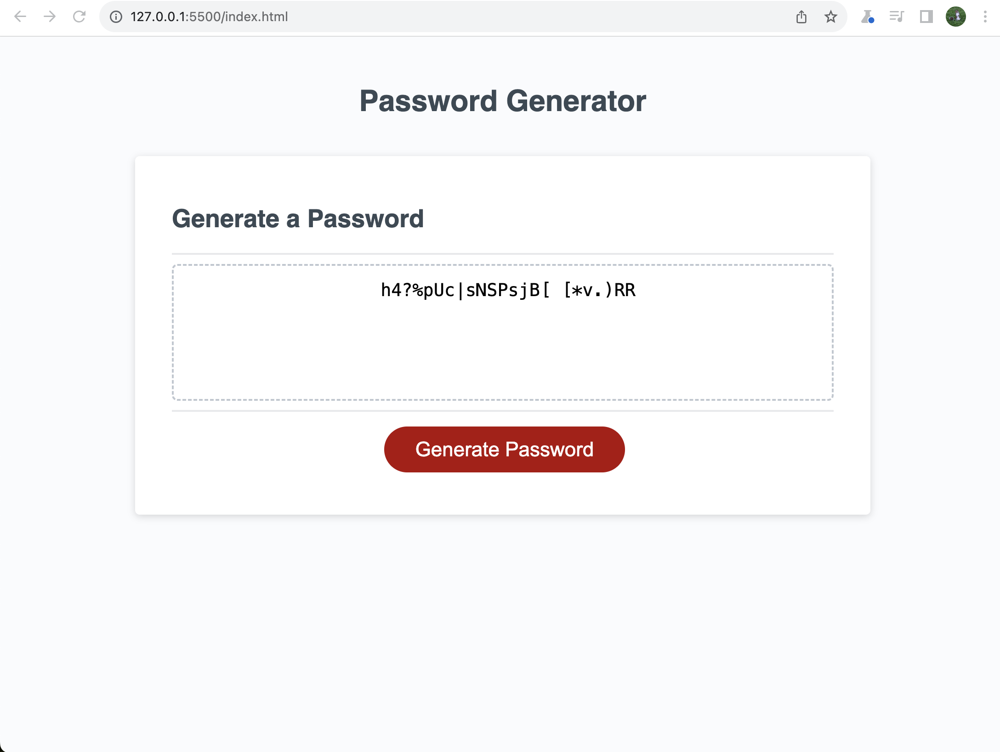

# Password Generator

## What has been done:

- after pressing red button "Generate password" creates series of prompts for password criteria: length, upper/lower case letters, numbers, special characters;
- each input is validated
- created function to generate password
- password is displayed on the page in "Your Secure password" box

## Live URL can be found here:

https://yuliyatsoy.github.io/password-generator/

## The following screenshot shows web application appearence:

## Credits:

1. I applied some hints and heads ups from my TA to navigate through the process of resolving this task
